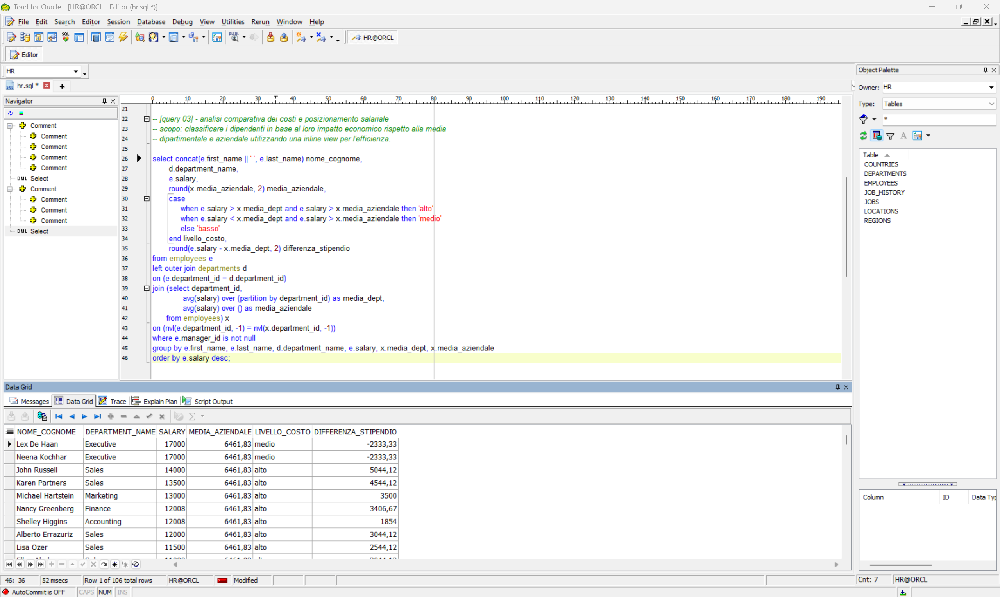
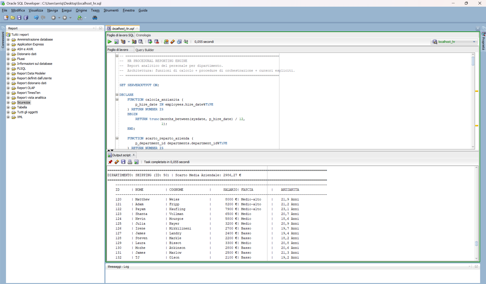

# Oracle SQL & PL/SQL — HR Advanced Analysis

This repository demonstrates two complementary skill sets on the standard Oracle **HR sample schema**: advanced **analytical SQL** for Business Intelligence, and a **procedural PL/SQL engine** that turns that analytical thinking into a structured, reusable reporting tool.

The project is organized into two scripts, each showcasing a different way of working with data:

| File | Focus | What it shows |
|------|-------|---------------|
| `HR_Advanced_Analytic_Project.sql` | **Set-based SQL** | 5 advanced analytical queries (PIVOT, hierarchical, window functions…) |
| `HR_Procedural_Reporting_Engine.sql` | **Procedural PL/SQL** | Functions + procedures + explicit cursors that generate a formatted report |

---

## Part 1 — Advanced Analytical SQL

A collection of **5 advanced SQL queries** that transform raw relational data into meaningful Business Intelligence. The goal is to solve complex organizational challenges — financial trend analysis, hierarchical reporting, salary benchmarking, and data quality auditing — with queries optimized for performance and designed to provide actionable insights for HR managers and executives.

### 1. Evolutionary Salary Expenditure (Pivot Reporting)
**Techniques:** Common Table Expressions (`WITH`), `PIVOT`, `EXTRACT`.
**Description:** Normalizes hiring dates into decades and rotates the data into columns to show total salary expenditure trends from the 1980s to the present.
**Business value:** Identifies historical growth phases and the long-term financial impact of employee seniority.

### 2. Comparative Cost Analysis (Logical Benchmarking)
**Techniques:** `CASE WHEN`, `OVER(PARTITION BY)`, inline view.
**Description:** Categorizes each employee as a HIGH, MEDIUM or LOW cost asset by comparing their salary against both their department average and the overall company average simultaneously.
**Business value:** Supports salary review processes by identifying pay deviations against internal benchmarks.

### 3. Organizational Chart Reconstruction (Hierarchical Queries)
**Techniques:** `CONNECT BY PRIOR`, `START WITH`, `SYS_CONNECT_BY_PATH`.
**Description:** Rebuilds the entire corporate reporting structure starting from the CEO, using `LPAD` formatting to visually represent the depth of the organization.
**Business value:** Essential for organizational audits, clarifying reporting lines, and identifying management spans of control.

### 4. Ranking and Budget Impact (Window Functions)
**Techniques:** `RANK()`, `LEAD()`, `SUM() OVER`.
**Description:** Generates a descending salary rank within each department, calculates the percentage of the department budget consumed by each individual, and shows the salary gap between consecutive ranks.
**Business value:** Highlights top earners and supports a balanced distribution of financial resources across teams.

### 5. Data Quality and Audit (Exists & Filtering)
**Techniques:** `EXISTS`, `NVL`, `ROWNUM`, `RPAD`.
**Description:** Performs a clean sweep of the data by normalizing strings (names and emails), validating record integrity against active departments, and sampling the result set for testing.
**Business value:** Ensures exported data is audit-ready and compliant with data governance standards.

---

## Part 2 — HR Procedural Reporting Engine (PL/SQL)

While Part 1 demonstrates set-based analytical thinking, this component showcases **procedural programming**: encapsulating logic in reusable functions, orchestrating it through nested procedures, and processing data row by row with explicit cursors.

### What it does
The engine produces a structured, department-by-department personnel report. For every department it prints each employee together with a computed salary band and seniority, and shows how the department's average salary deviates from the company-wide average.

### Architecture
Three cooperating layers, mirroring how real procedural code is organized:

- **Functions (atomic calculations)**
  - `calcola_anzianita` — computes an employee's seniority in years from the hire date.
  - `scarto_reparto_azienda` — returns the gap between the company average salary and a given department's average (safely handling empty departments, where `AVG` returns `NULL`).
  - `classifica_stipendio` — classifies a salary into a band (Low / Medium / Medium-High / High).

- **Procedures (orchestration, with explicit cursors)**
  - `stampa_dipendenti_dipartimento` — opens a cursor over the employees of one department and prints a formatted table, calling the functions above for each row.
  - `stampa_risorse` — the master procedure: iterates over all departments with a cursor and delegates detail rendering to the procedure above.

- **Anonymous block (entry point)** — invokes the master procedure to run the full report.

### Techniques demonstrated
Explicit cursors (`DECLARE` / `OPEN` / `FETCH` / `CLOSE`, `%NOTFOUND`), local functions and procedures with parameters and return values, `%TYPE`-anchored declarations, `CASE` expressions, `NULL` handling for aggregate edge cases, and defensive exception handling (`WHEN OTHERS` with a guarded `%ISOPEN` cursor close).

---

## Core Competencies Demonstrated

- **Analytical depth** — advanced window functions that perform complex calculations without losing row-level detail.
- **Data transformation** — converting granular records into multidimensional reports via `PIVOT` and `CASE` logic.
- **Procedural design** — structuring logic into cooperating functions, procedures and cursors, the way production PL/SQL is built.
- **Data integrity** — careful handling of `NULL` values and referential integrity for accurate reporting.
- **Performance awareness** — use of `EXISTS` and inline views to minimize server overhead.

---

## How to Use

Both scripts target any Oracle database instance containing the standard **HR sample schema**.

1. Open the desired script in **Oracle SQL Developer** or **TOAD**.
2. For the procedural engine, enable server output first: `SET SERVEROUTPUT ON;`
3. Execute the script to see the formatted output.
4. Review the inline comments for detailed logic explanations.
